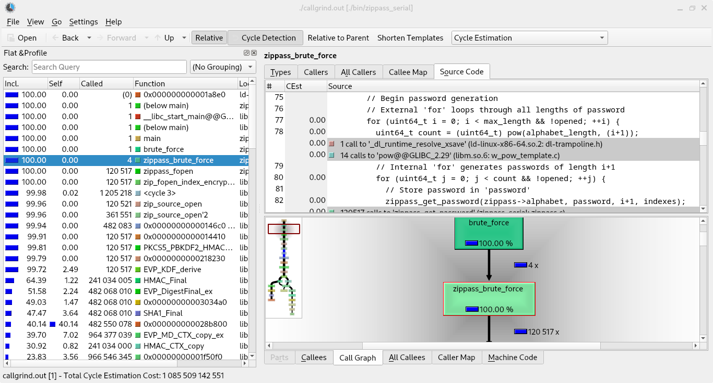
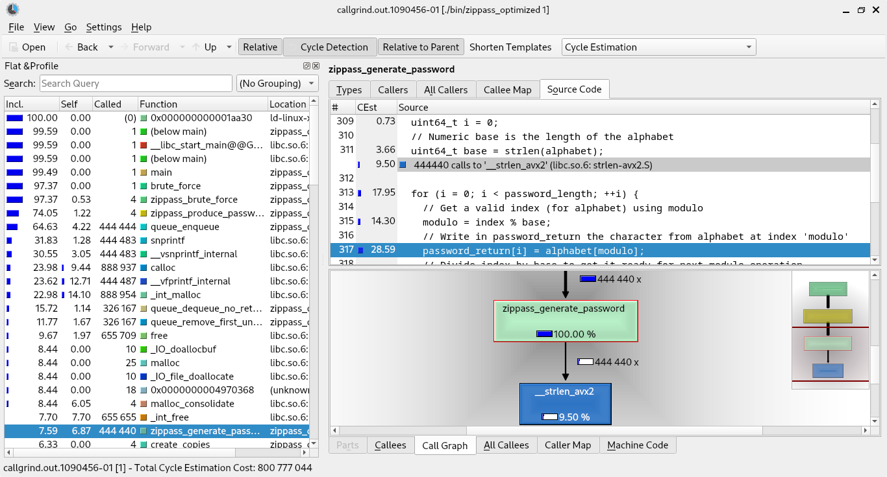
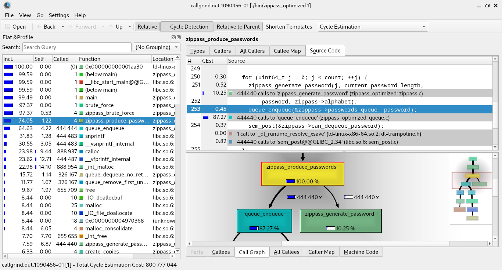
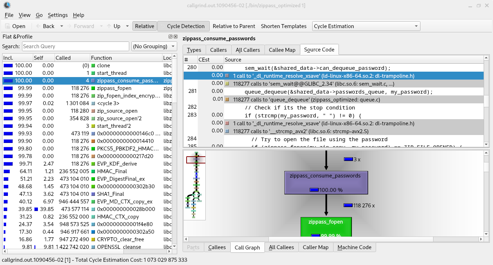
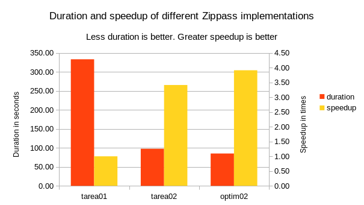
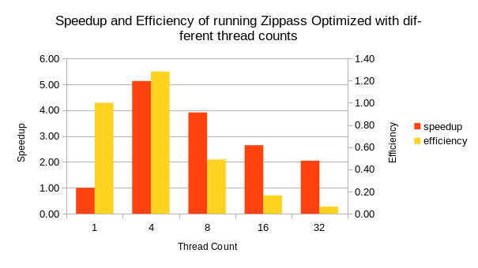

= Zipass OMP-MPI - Report
:experimental:
:nofooter:
:source-highlighter: pygments
:stem:
:toc:
:xrefstyle: short

[[Introduction]]
== Introduction

This file reports all optimizations done to this project. To calculate execution times, the test cases input001.txt, input003.txt and input004.txt will be put to use. All calculations are done in a laptop with an intel processor of 8 cores.

=== Tools
- perf: to calculate execution times.
- callgrind: to generate profiling reports
- kcachegrind: to visualize profiling reports

== First Optimization: Zippass Serial

=== Profiling

The following screenshot show the report of callgrind when running zippass_serial. 

The profiling shows that the heaviest task is in fact, attempting to open the encrypted file, and therefore, there isn't much to do to optimize zippass_serial. Few things could be done, like making zippass_brute_force attack all zip archives instead of one, or calculating the password count (pow function, line 78) only once, however, based on this profiling, none of those ideas would actually optimize the program significantly.
==== Results

- input001: 95.079514885 seconds time elapsed
- input003: 333.320122548 seconds time elapsed
- input004: 8.152426544 seconds time elapsed

== Second Optimization: Zippass Thread

In this optimization, the main thread takes the role of producer and secondary threads take the role of consumers. The producer generates passwords and enqueues them in a thread-safe queue, while the consumers dequeues from it.

=== Results

- input001: 36.376386194 seconds time elapsed
- input003: 97.620149394 seconds time elapsed
- input004: 6.077517500 seconds time elapsed

== More Optimizations to Zippass Thread

In this section I try to optimize zippass_thread which is originally implemented with the producer-consumer pattern.

=== Profiling

The following screenshots show the result of running zippass_optimized (which is initially zippass thread) with callgrind, with only one secondary thread. Below each screenshot, a small proposal for optimizing the program is given.

==== Thread 0 (main thread, producer)

The first image reveals that the procedure zippass_generate_password() has to calculate the length of the alphabet everytime it's called (444440 times, line 311). A way to optimize this is to pass the length of the alphabet as an additional parameter.

This second image shows the notable differences of cost between generating passwords and enqueueing them. A proposal to optimize this procedure is to write passwords in an array instead of a thread-safe queue.

==== Thread 1 (secondary thread, consumer)

The first image shows that the functions sem_wait and dequeue are called many times. Using a shared array (conditionally safe) could be more efficient.

=== First Attempt

To optimize the program, the usage of a thread-safe queue will be completely removed and replaced by a conditionally safe array. The motivation for doing this is to avoid the queue's mutex and the program's semaphore. Aditionally, password generation will happen only once (contrary to the queue, which had to be constantly emptied and filled with passwords for every zip archive).

==== Results

This optimization didn't pass all test cases, getting automatically killed at input004.txt. Upon further inspection, it seems the problem is that this new version allocates too much memory (input004 causes the program to generate and store 12 million passwords!).

=== Second Attempt

Since allocating all passwords in memory is a really bad idea, this second implementation will make the main thread generate all passwords and store them in several files instead. Then, each thread will have its own set of passwords in its own separate file. Doing it this way, the problem of allocating too much memory is solved, since strings won't be stored in dynamic memory anymore. This implementation probably breaks the producer-consumer pattern, because the queue is completely removed (although you could still say the main thread is a producer and all secondary threads are consumers), and passwords are not mapped dynamically, but statically, by block. The only moment they need concurrency mechanisms is when they check if another thread has found the password yet.

==== Results

- input001: 50.763440764 seconds time elapsed
- input003: 165.041826530 seconds time elapsed
- input004: 4.166874923 seconds time elapsed

This program passed all test cases, but the results are dissapointing. Although the queue's mutex and the semaphore were successfully removed, this attempt made the program last longer. A hypothesis of why this is happening: reading passwords from a text file (specifically, from a hard drive) is creating a bottleneck. 

=== Third Attempt

A third attempt for optimizing zippass_thread will be letting secondary threads generate their own passwords. This time, the producer will only enqueue "blocks of indexes". These blocks are structs that contain an index to start from, an index to finish to, and a length of password (blocks won't have different lengths). Meanwhile, the consumers will dequeue these blocks and generate the passwords of that block. This new implementation will considerably reduce the frecuency of access to the queue and since passwords won't be stored anymore, the program will allocate much less memory. Also, the mapping will be different (although it's still dynamic), which could be beneficial in some cases.

==== Results

- input001: 36.181457026 seconds time elapsed
- input003: 91.992650172 seconds time elapsed
- input004: 0.474649724 seconds time elapsed

The program passed all test cases. The program shows improvements in terms of elapsed time, but it's not drastic. Aditionally, and even if it's not time related, it's important to point out that this new implementation allocates too much less memory in comparison with Zippass Thread.

== Zippass OMP MPI
This implementation removed the usage of pthreads and utilizes two technologies: OpenMP, which is used to parallelize code and MPI, which is an interface to pass messages among processes.

=== OMP

The usage of OMP greatly reduces the length of the code and is significantly easier to use than Pthreads. OMP is a declarative technology, so the parallelization is done by simply stating where it should start and where is should finish, using declarations like "omp parallel" and "omp for".

To parallelize the production of passwords, OMP requires "pure" for statements, which refer to a for statement that is not interrupted by the keywords "break" or "return" and the amount of data that will be parallelized is known (iterators, and while statements cannot be parallelized by OMP).

There is a disadvantage while using this technology. Using pthreads, the loops were able to be broken and the team of threads were constantly checking if another thread had found the password. Since the loops cannot be broken in OMP, all passwords have to be tried, even if the correct password has already been found. The worst case would be if the first generated password successfully brute forces the zip file.

==== Results

- input001: 145.145457071 seconds time elapsed
- input003: 371.165103951 seconds time elapsed
- input004: 5450.920745128 seconds time elapsed

=== MPI

MPI is a technology that enables communication for a world of processes. Since MPI doesn't replace anything like OMP did with Pthreads, it should make the program finish faster if used under the right conditions. Message passing among processes is different than sharing data among threads. If two processes want to communicate, they'll need intervention from the OS, because processes don't share memory like how a team of threads do. Maybe because of that, communication is much slower and expensive. Efficiency is really scalable if each process is able to run in a different machine. So for example, if four processes are created to do a job file, and there are four connected computers, then the power of four machines with four CPUs each can be used.

In this implementation, a world of processes map the total of zip files from a job file, in contrast with the threads mapping passwords. 

==== Results

== Table Summary

Here is a table that summarizes all execution times

[cols="h,1,1,1"]
|===
^|Zippass ^|input001 ^|input003 ^|input004

^|Serial ^|95.07s ^|333.32s ^|8.15s
^|Thread ^|36.37s ^|97.62s ^|6.07s
^|Optimized: Second Attempt ^|50.76s ^|165.04s ^|4.16s
^|Optimized: Third Attempt ^|36.18s ^|91.99s ^|0.47s
|===

== Concurrency level

This first graph shows a significant improvement of the threaded version(tarea02) and the optimized version of Zippass (optim02) over the serial version(tarea01), shortening the duration of execution from a little more than 300 seconds to a little less than 100 seconds. It also shows that the threaded version is close to being three and a half times faster, while the optimized version is almost four times faster than the serial implementation.

.Durations and speedup of all Zippass implementations while working on input003.txt

The second graph displays the different speedups and efficiencies of Zippass Optimized using different thread counts. Interpreting the graph, it seems running the program with four threads showed the best speedup and efficiency, while running it with thirty two showed the worst. This could possibly imply that around 8 threads, the thread-safe queue starts becoming a bottle-neck or maybe it is at this point where the CPU can't keep up with the amount of threads.

.Speedup and efficiency of Zippass Optimized with several thread counts, while working on input003.txt

=== ¿What is most optimal amount of threads to reach the highest performance?

R/ The data sugests that four threads is enough the reach the most optimal performance. 
