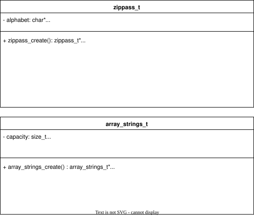

= Zippass Serial Design
:experimental:
:nofooter:
:source-highlighter: pygments
:stem:
:toc:
:xrefstyle: short

== The main procedure

The main procedure is divided into three elemental parts: data loading, data processing and data output.

Before reading from stdin, main allocates three data structures: 

* zippass_t zippass: used for password generation and brute forcing.
* array_strings_t zips: array of strings to store zip paths.
* array_strings_t passwords: array of strings to store passwords.

If allocation is successful, main will read from stdin and store data in 'zippass' and 'zips'. Then, it will try to brute force each zip found 'zips' and write passwords in 'passwords'. Finally, it will print each zip alongside the password that opens it (or just the zip if the password was not found) and free all allocated memory.

image::main.svg[]

[source]
====
include::main.pseudo[]
====

== Brute force

The brute forcing procedure is in charge of opening a zip archive, and generating passwords to brute force one of the encrypted files in the archive. Passwords are generated in a sequential manner, using the information that zippass provides(an alphabet and a length limit). The procedures get_password and next_password utilizes an array of integers that are valid indexes in the alphabet string. The password's length (and thus, the array's) are incremental, both of them starting at length 1.

[source]
====
include::zippass.pseudo[]
====

== Structs

The following structs were used. 

* zippass_t is a made up datatype used for password generation and brute forcing.
* array_strings_t is a dynamic array of strings used to store paths to zip archives and passwords.

