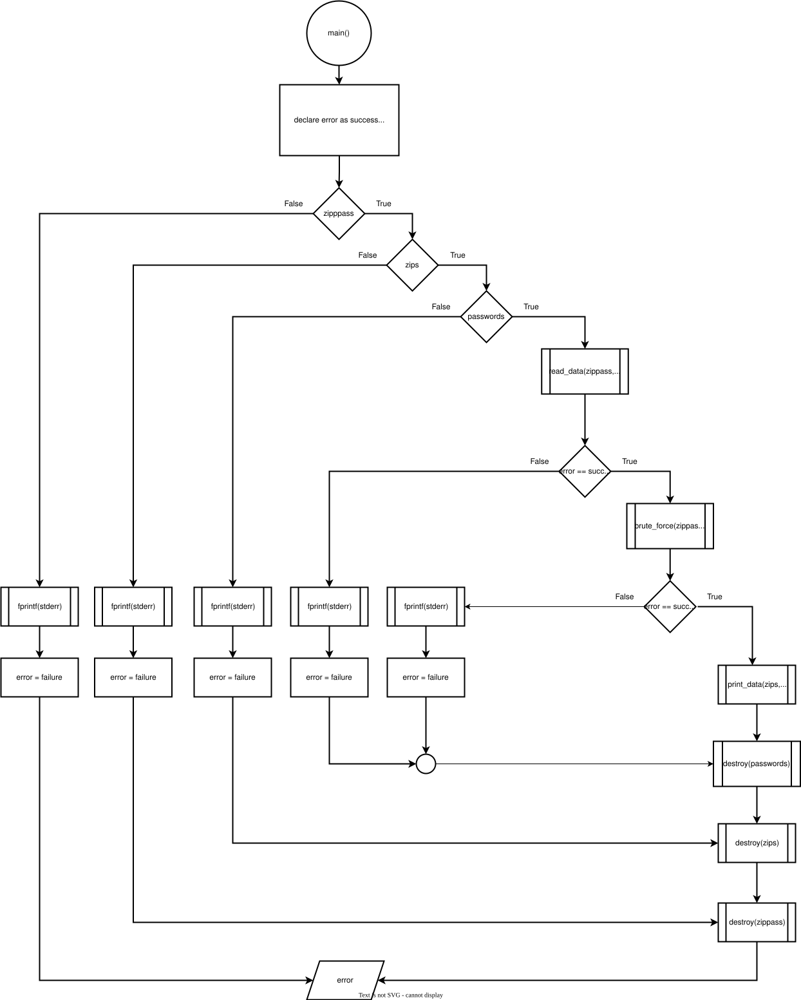
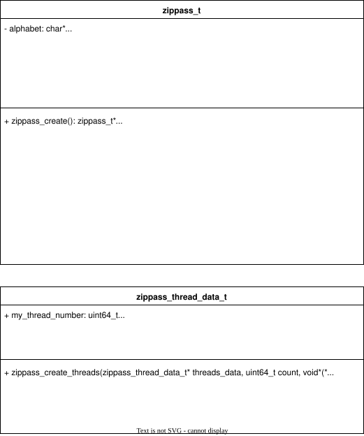
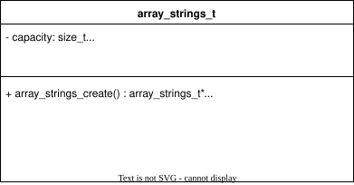
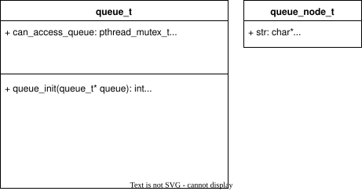

= Zippass Thread Design
:experimental:
:nofooter:
:source-highlighter: pygments
:stem:
:toc:
:xrefstyle: short

== The main procedure

The main procedure is divided into three elemental parts: data loading, data processing and data output.

Before reading from stdin, main allocates three data structures: 

* zippass_t zippass: used for password generation and brute forcing.
* array_strings_t zips: array of strings to store zip paths.
* array_strings_t passwords: array of strings to store passwords.

If allocation is successful, main will read from stdin and store data in 'zippass' and 'zips'. Then, it will try to brute force each zip found 'zips' and write passwords in 'passwords'. Finally, it will print each zip alongside the password that opens it (or just the zip if the password was not found) and free all allocated memory.

[source]
====
include::main.pseudo[]
====

== Brute force

The brute forcing procedure is in charge of implementing the producer-consumer pattern. It will first create the consumer's data and then the consumers (the team of threads). Then, it will generate all possible passwords and enqueue them. Finally, it will wait for the consumer's to finish.

Note: The idea of creating a separate thread to make it produce passwords was discarted because password generation proved to be a really fast procedure. 

[source]
====
include::zippass.pseudo[]
====

== Produce Passwords

This procedure generates all possible passwords using the alphabet and the maximum length of a password (both are attributes that zippass_t provides), and then enqueues them in a shared queue. This procedure behaves as the producer in the producer-consumer pattern.

include::produce_passwords.pseudo[]

== Consume Passwords

This procedure dequeues passwords from a shared queue and attempts opening an encrypted zip file using it. It constantly checks if the encrypted zip file was already opened by another thread. This procedure behaves as the consumer in the producer-consumer pattern. Also, it is the procedure that the team of threads will run, meaning this pattern has one producer and possibly several consumers.

include::consume_passwords.pseudo[]

== Structs

The following structs were used. 

* zippass_t is a made up datatype used for password generation and brute forcing.
* zippass_thread_data_t is the private_data for each string
* array_strings_t is a dynamic array of strings used to store paths to zip archives and passwords.
* queue_t is a queue of strings. It is thread-safe.
* queue_node_t is the node datatype for queue_t.

